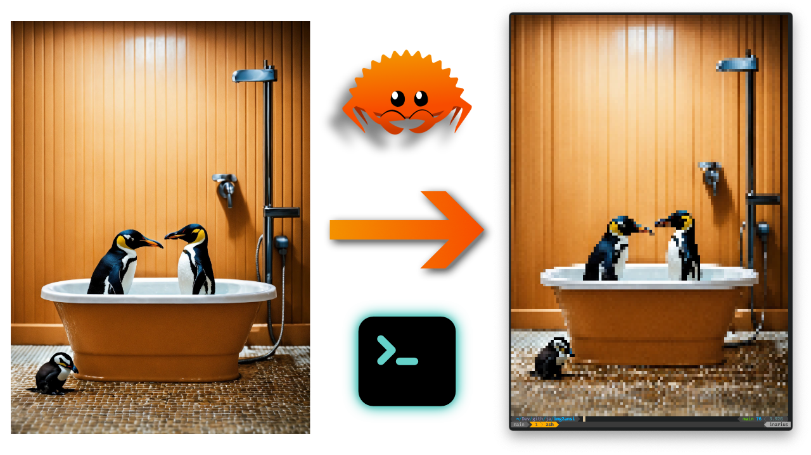

# img2ansi

A simple image to ansi converter, which uses unicode half-block characters to display and realize pixels in the terminal.

An image is loaded resized and then it is printed as unicode characters to the terminal the command is run in.

## TODO

[ ] Provide argument parsing interface instead of hardcoding the loaded image within the codebase
[ ] Allow custom sized output instead of always fitting the image to the output terminal

## YouTube

I published a video, which shows how this little tool was created. If you are interested check it out: https://youtu.be/MMJ1KRzWZwI
